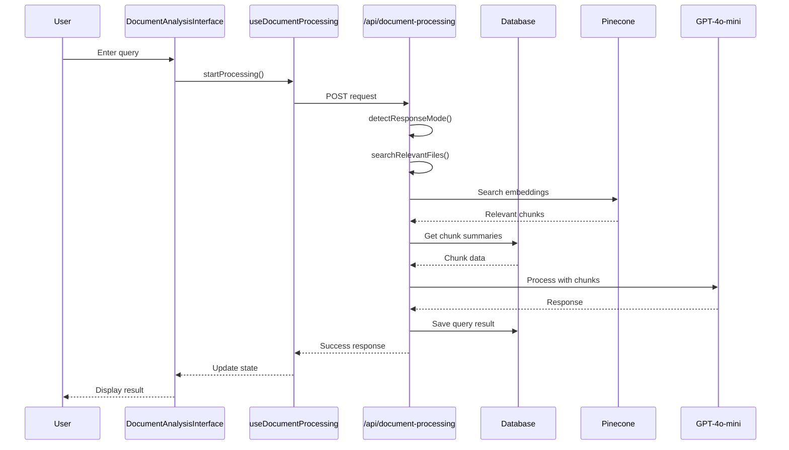
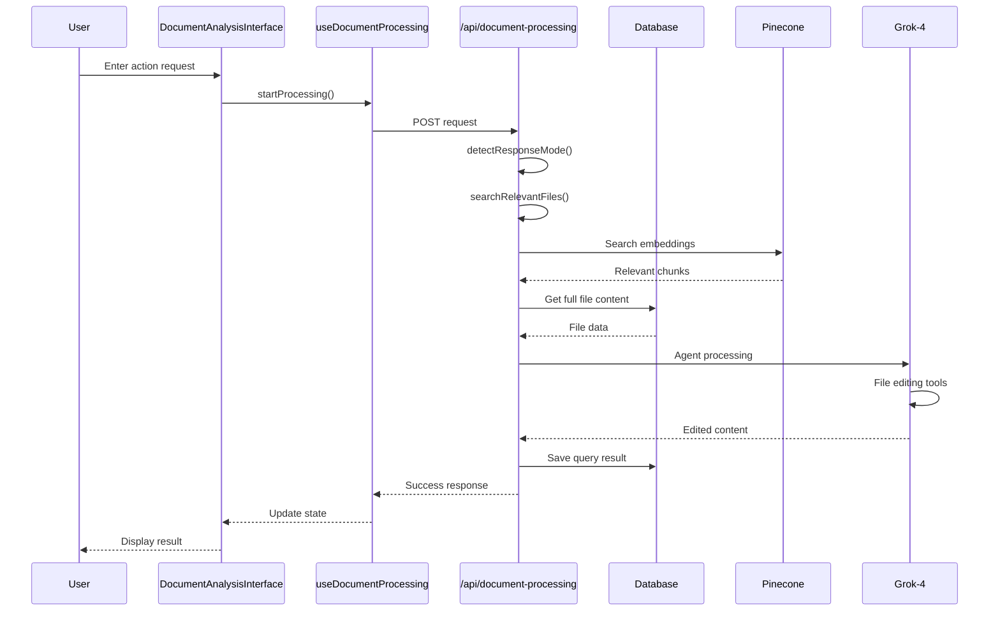
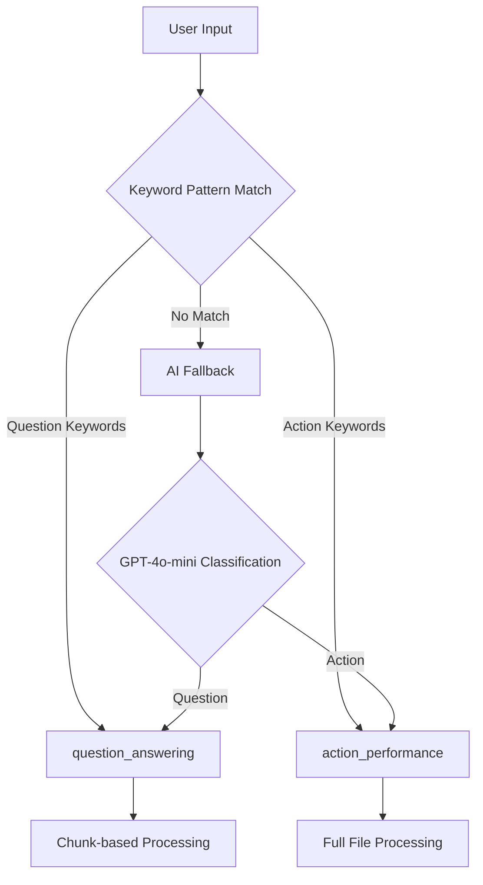
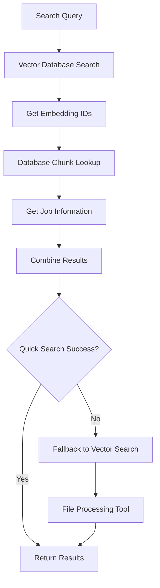
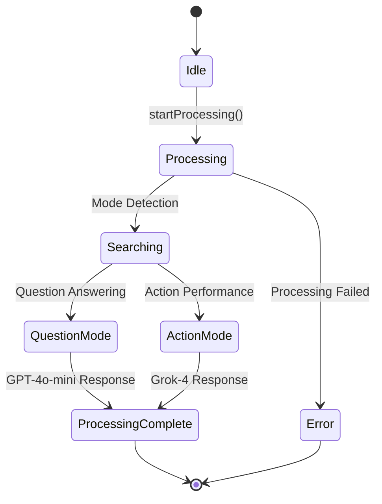
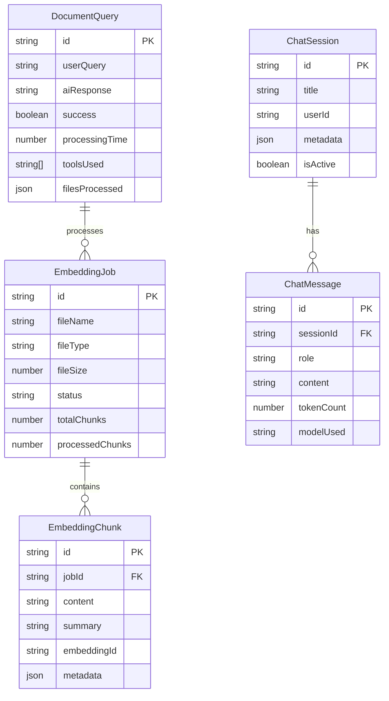
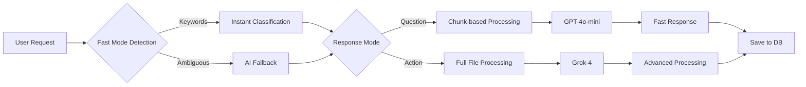
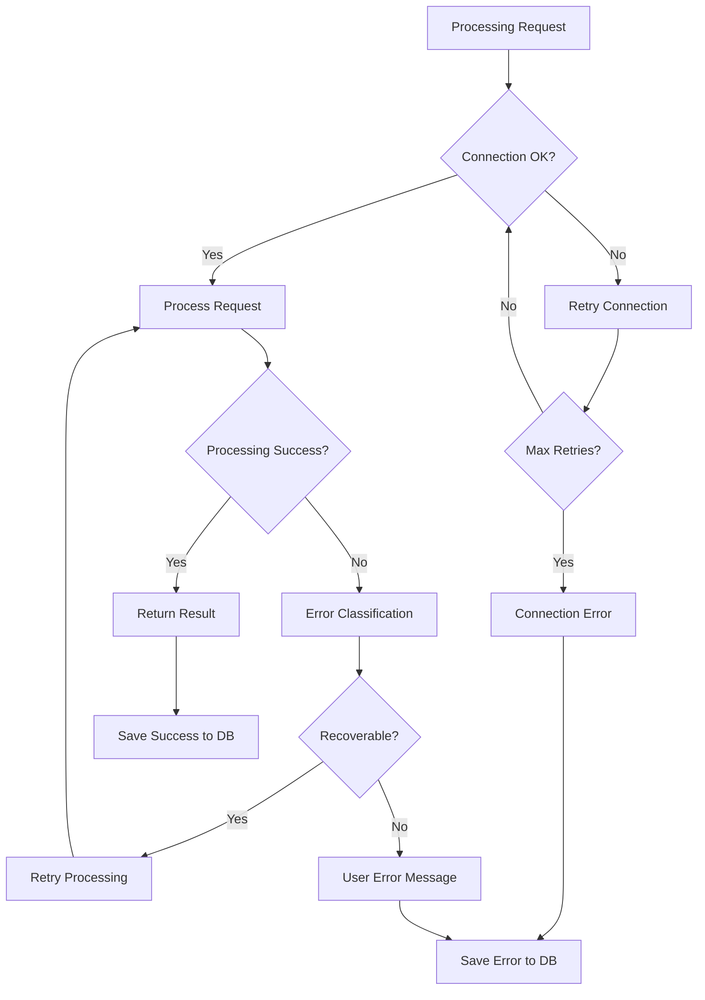
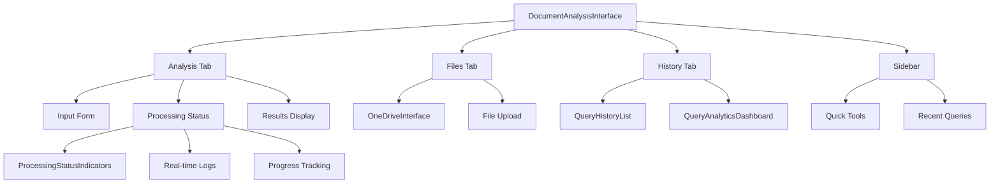

# Document Processing System - Flow Diagrams

## 1. High-Level System Architecture

```mermaid
graph TB
    subgraph "Frontend Layer"
        A[DocumentAnalysisInterface]
        B[ProcessingStatusIndicators]
        C[QueryHistoryDashboard]
        D[useDocumentProcessing Hook]
    end
    
    subgraph "API Layer"
        E[/api/document-processing/route.ts]
        F[Mode Detection]
        G[File Search]
        H[Processing Engine]
    end
    
    subgraph "AI Models"
        I[GPT-4o-mini]
        J[Grok-4]
    end
    
    subgraph "Data Layer"
        K[PostgreSQL Database]
        L[Pinecone Vector DB]
        M[File Storage]
    end
    
    A --> D
    D --> E
    E --> F
    F --> G
    G --> H
    H --> I
    H --> J
    E --> K
    E --> L
    E --> M
```

## 2. Processing Flow - Question Answering Mode



## 3. Processing Flow - Action Performance Mode



## 4. Mode Detection Flow



## 5. File Search and Retrieval Flow



## 6. Real-time Processing State Management



## 7. Database Schema Relationships



## 8. Performance Optimization Strategy



## 9. Error Handling and Recovery



## 10. User Interface Component Hierarchy



## Key Performance Metrics

| Metric | Target | Current |
|--------|--------|---------|
| Mode Detection | < 1s | ~0.5s |
| Question Answering | 2-5s | ~3s |
| Action Performance | 5-15s | ~8s |
| File Processing | 1-3s/file | ~2s/file |
| Database Queries | < 500ms | ~300ms |

## System Benefits

1. **Dual-Mode Architecture**: Optimized for both information retrieval and document manipulation
2. **Smart Mode Detection**: Fast keyword-based classification with AI fallback
3. **Vector-First Search**: Efficient semantic search across all documents
4. **Cost Optimization**: Appropriate AI model selection based on task complexity
5. **Real-time Feedback**: Comprehensive progress tracking and user feedback
6. **Error Recovery**: Robust error handling and graceful degradation
7. **Scalable Design**: Modular architecture for easy maintenance and enhancement
