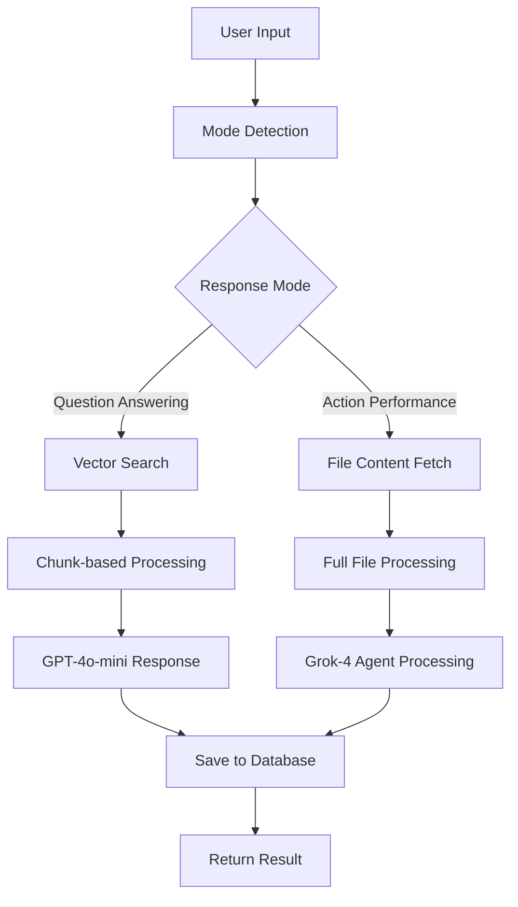

# AI Document Processing System - Technical Documentation

## Overview

The AI Document Processing System is a sophisticated document analysis and manipulation platform that uses advanced AI models to process, analyze, and manipulate documents. The system supports two main modes: **Question Answering** (information extraction) and **Action Performance** (document manipulation).

## System Architecture

### Core Components

1. **Frontend Interface** (`DocumentAnalysisInterface.tsx`)
2. **API Processing Engine** (`/api/document-processing/route.ts`)
3. **Real-time Processing Hook** (`useDocumentProcessing.ts`)
4. **Query History Management** (`useQueryHistory.ts`)
5. **Database Layer** (Prisma with PostgreSQL)
6. **Vector Database** (Pinecone for semantic search)
7. **AI Models** (GPT-4o-mini, Grok-4)

## Processing Flow Diagram



## Detailed Processing Flow

### 1. User Input Processing

**Location**: `DocumentAnalysisInterface.tsx`
- User enters query in text area
- System validates input
- Triggers processing via `useDocumentProcessing` hook

### 2. Mode Detection

**Location**: `route.ts` - `detectResponseMode()`
- **Fast keyword-based detection** (instant for common patterns)
- **AI fallback** using GPT-4o-mini for ambiguous cases
- **Two modes detected**:
  - `question_answering`: User wants to GET INFORMATION from documents
  - `action_performance`: User wants to PERFORM ACTIONS on documents

**Keywords for Detection**:
- **Question Answering**: "what", "how", "summarize", "analyze", "extract", "key points"
- **Action Performance**: "edit", "modify", "create", "write", "add", "remove", "merge"

### 3. File Search and Retrieval

**Location**: `route.ts` - `searchRelevantFiles()`

#### Vector-First Search Approach:
1. **Vector Database Search** (Pinecone)
   - Search across ALL chunks using semantic similarity
   - Get relevance scores and metadata
2. **Database Enrichment**
   - Fetch chunk summaries from PostgreSQL
   - Get job information and file metadata
   - Combine vector results with database info

#### Smart Fallback Strategy:
- **Primary**: Quick summary-based search
- **Fallback**: Vector similarity search
- **Error Handling**: Graceful degradation with user feedback

### 4. Processing Modes

#### A. Question Answering Mode

**Location**: `route.ts` - `processQuestionAnswering()`

**Process**:
1. **Chunk-based Context**: Use document summaries and chunks
2. **GPT-4o-mini Processing**: Cost-effective model for Q&A
3. **No Full File Fetching**: Optimized for speed
4. **Response Generation**: Comprehensive answers based on available content

**Performance Benefits**:
- ⚡ **Fast processing** (no full file downloads)
- 💰 **Cost-effective** (GPT-4o-mini)
- 🎯 **Relevant results** (vector search + summaries)

#### B. Action Performance Mode

**Location**: `route.ts` - `processActionPerformance()`

**Process**:
1. **Full File Content Fetching**: Get complete file content
2. **Grok-4 Agent Processing**: Advanced reasoning for complex tasks
3. **File Editing Tools**: Direct file manipulation capabilities
4. **Agentic Workflow**: Multi-step reasoning and execution

**Performance Benefits**:
- 🧠 **Advanced reasoning** (Grok-4 model)
- 🔧 **File manipulation** (edit, merge, create)
- 🎯 **Complex workflows** (multi-step operations)

### 5. Real-time Processing

**Location**: `useDocumentProcessing.ts`

**Features**:
- **Real-time State Management**: Processing status, progress, errors
- **Event Tracking**: Detailed logging of processing steps
- **Connection Management**: Automatic reconnection and error handling
- **Progress Indicators**: Visual feedback for users

**State Management**:
```typescript
interface ProcessingState {
  isProcessing: boolean
  isConnected: boolean
  events: ProgressEvent[]
  currentStep: number
  totalSteps: number
  operationChain: OperationStep[]
  intermediateResults: string[]
  finalResult: string | null
  error: string | null
  processedFiles: any[]
  confidence: number
  isChain: boolean
  processingTime: number
}
```

### 6. Database Integration

**Location**: Prisma schema and database operations

**Key Tables**:
- `DocumentQuery`: Stores processing results and metadata
- `EmbeddingJob`: File processing jobs and metadata
- `EmbeddingChunk`: Document chunks with summaries
- `ChatSession`: Chat history and sessions
- `ChatMessage`: Individual chat messages

**Data Flow**:
1. **Query Storage**: All processing requests saved
2. **Result Tracking**: Success/failure rates, processing times
3. **File Metadata**: File information, chunk counts, processing status
4. **User Analytics**: Usage patterns, tool preferences

### 7. Vector Database Integration

**Location**: Pinecone integration in `route.ts`

**Features**:
- **Semantic Search**: Find relevant content using embeddings
- **Cross-Document Search**: Search across all processed documents
- **Relevance Scoring**: Rank results by semantic similarity
- **Metadata Enrichment**: Combine vector results with database info

## Performance Optimizations

### 1. Fast Mode Detection
- **Keyword-based detection** for instant classification
- **AI fallback** only for ambiguous cases
- **Timeout protection** (5-second limit)

### 2. Smart File Retrieval
- **Vector-first approach**: Search vector DB before database
- **Chunk-based processing**: Use summaries for Q&A mode
- **Full file fetching**: Only for action performance mode
- **Deduplication**: Avoid duplicate file processing

### 3. Model Strategy
- **GPT-4o-mini**: Basic tasks (mode detection, Q&A, simple editing)
- **Grok-4**: Complex agentic workflows and advanced reasoning
- **Cost optimization**: Use appropriate model for task complexity

### 4. Caching and Optimization
- **File content caching**: Avoid re-fetching same files
- **Summary-based search**: Fast retrieval using pre-computed summaries
- **Connection pooling**: Efficient database connections
- **Error recovery**: Graceful handling of failures

## User Interface Components

### 1. Main Interface (`DocumentAnalysisInterface.tsx`)
- **Unified Interface**: Single component for all document operations
- **Tab-based Navigation**: Analysis, Files, History
- **Real-time Feedback**: Processing indicators and progress
- **Result Display**: Formatted results with file information

### 2. Processing Status (`ProcessingStatusIndicators.tsx`)
- **Real-time Logs**: Live processing events
- **Progress Tracking**: Step-by-step operation progress
- **Status Cards**: Connection, progress, files, timing
- **Error Handling**: Clear error messages and recovery options

### 3. Query History (`QueryHistoryDashboard.tsx`)
- **Dashboard View**: Analytics and recent queries
- **Full History**: Complete query history with search/filters
- **Query Details**: Detailed view of processing results
- **Reuse Functionality**: Re-run previous queries

## Error Handling and Recovery

### 1. Connection Management
- **Automatic Reconnection**: Handle network issues
- **Timeout Protection**: Prevent hanging requests
- **Graceful Degradation**: Fallback options for failures

### 2. Processing Errors
- **Detailed Error Messages**: Clear user feedback
- **Error Classification**: Different handling for different error types
- **Recovery Options**: Retry mechanisms and alternative approaches

### 3. Database Errors
- **Transaction Safety**: Rollback on failures
- **Data Consistency**: Ensure data integrity
- **Error Logging**: Comprehensive error tracking

## Security and Data Protection

### 1. Authentication
- **Session Management**: Secure user sessions
- **Token-based Access**: API key management
- **User Isolation**: Data separation between users

### 2. Data Privacy
- **Secure Storage**: Encrypted data at rest
- **Access Control**: User-specific data access
- **Audit Logging**: Track all operations

### 3. API Security
- **Input Validation**: Sanitize all user inputs
- **Rate Limiting**: Prevent abuse
- **Error Sanitization**: Don't expose sensitive information

## Monitoring and Analytics

### 1. Performance Metrics
- **Processing Times**: Track operation duration
- **Success Rates**: Monitor system reliability
- **User Analytics**: Usage patterns and preferences

### 2. System Health
- **Connection Status**: Monitor API connectivity
- **Error Rates**: Track failure patterns
- **Resource Usage**: Monitor system resources

### 3. User Insights
- **Query Patterns**: Common user requests
- **Tool Usage**: Most used processing tools
- **Performance Trends**: System improvement opportunities

## Future Enhancements

### 1. Advanced Features
- **Multi-language Support**: Process documents in different languages
- **Custom Models**: User-specific AI model training
- **Batch Processing**: Handle multiple documents simultaneously
- **API Integration**: Connect with external services

### 2. Performance Improvements
- **Caching Layer**: Redis for faster data access
- **CDN Integration**: Faster file delivery
- **Load Balancing**: Handle high traffic
- **Auto-scaling**: Dynamic resource allocation

### 3. User Experience
- **Mobile Optimization**: Responsive design improvements
- **Offline Support**: Work without internet connection
- **Collaboration Features**: Multi-user document processing
- **Custom Workflows**: User-defined processing chains

## Technical Specifications

### 1. System Requirements
- **Node.js**: 18+ for server-side processing
- **Database**: PostgreSQL with Prisma ORM
- **Vector DB**: Pinecone for semantic search
- **AI Models**: OpenAI GPT-4o-mini, Grok-4
- **Frontend**: React 18+ with TypeScript

### 2. Performance Benchmarks
- **Mode Detection**: < 1 second
- **Question Answering**: 2-5 seconds
- **Action Performance**: 5-15 seconds
- **File Processing**: 1-3 seconds per file
- **Database Queries**: < 500ms average

### 3. Scalability
- **Concurrent Users**: 100+ simultaneous users
- **Document Volume**: 10,000+ documents
- **Processing Speed**: 50+ queries per minute
- **Storage**: Terabyte-scale document storage

## Conclusion

The AI Document Processing System represents a sophisticated approach to document analysis and manipulation, combining advanced AI models with efficient processing strategies. The system's dual-mode architecture ensures optimal performance for both information retrieval and document manipulation tasks, while maintaining cost-effectiveness and user experience.

The modular design allows for easy maintenance and future enhancements, while the comprehensive error handling and monitoring ensure system reliability and user satisfaction.
